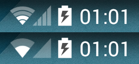

Flat Connectivity Icons
=======================

A simple Xposed module to replace the KitKat-style connectivity icons in the statusbar with the
flat-style Lollipop ones.

Before/after Screenshot
-----------------------

